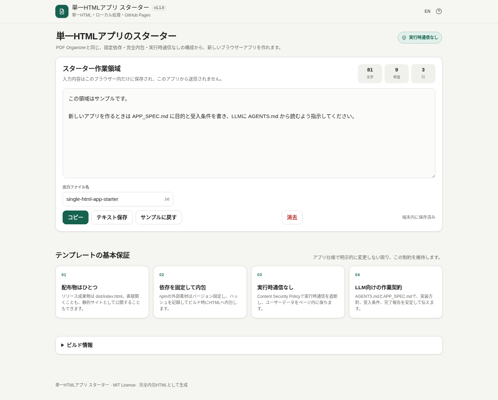

# Single HTML App Template

[](https://github.com/ttomohisa/htmlapps-template/actions/workflows/deploy-pages.yml)
[](LICENSE)
[](https://ttomohisa.github.io/htmlapps-template/)

[English README](README.md)

**配布物が1つのHTMLだけで完結する、プライバシーに配慮したブラウザーアプリ**を作るためのGitHubリポジトリテンプレートです。

[PDF Organizer](https://github.com/ttomohisa/html-pdf-organizer) で採用している「読みやすい開発用ソースから、固定バージョンのライブラリ、Worker、WASM、フォント、補助素材などをビルド時に内包し、生成物を検証してGitHub Pagesへ公開する」構成を、さまざまな単一HTMLアプリで再利用できる形に整理しています。

## 🚀 デモ

### [GitHub Pagesでスターターを開く](https://ttomohisa.github.io/htmlapps-template/)

GitHub Pagesから最初のHTMLを取得した後は、アプリ内の処理をブラウザー内で完結させられる構成です。初期設定ではContent Security Policyにより実行時のネットワーク接続を遮断します。

[](https://ttomohisa.github.io/htmlapps-template/)

## 主な機能

- ブラウザーアプリ全体を `dist/index.html` 1ファイルへビルドし、リポジトリ名先頭の `htmlapps-` を外した名前（例: `htmlapps-tap-counter` → `tap-counter.html`）でもリポジトリ直下へ自動コピー
- gzip自己解凍版 `dist/index.self-extract.html` も任意で生成
- Windowsでは `build-standalone.bat` をダブルクリックしてビルド可能
- 標準のビルド手順ではPythonやNode.jsが不要
- npmパッケージのバージョンを固定し、指定したファイルだけを内包
- `dependencies.lock.json` でpackage tarballのSHA-256も固定
- 週1回新版を確認し、自動更新やPR作成はせずGitHub Issueで通知
- 大容量assetは必要に応じて `gzip` / `auto` 圧縮で内包
- 取得したpackage tarballと内包ファイルのSHA-256を記録
- `connect-src 'none'` により実行時のネットワーク接続を遮断
- 実行時CDN、外部フォント、分析タグ、テレメトリを初期状態では使用しない
- ビルド前にWindows PowerShellの構文・文字コードを検査し、引用符ミスやBOMなし非ASCIIスクリプトを早期検出
- GitHub Actionsでビルド検証とGitHub Pages公開
- Cloudflare用Secretが設定されたリポジトリでは、PRごとにWorkers Previewを自動作成し、疎通確認後に固定Preview URLをPRへコメント
- `assets/favicon.svg` をfaviconと左上ブランドアイコンの共通ソースとして使用
- 日英UI、レスポンシブ表示、キーボード操作、ライトモード固定のスターター
- 確認ダイアログ、Undo Toast、ポップオーバーメニュー、数値設定、非同期状態ガード、ページ切替対応のスマホ固定ボトムバーを再利用可能
- 製品仕様を `APP_SPEC.md`、コーディングLLM向け実装ルールを `AGENTS.md` に分離
- ファイル出力アプリでは、保存前に出力ファイル名を編集できることを共通UXルール化
- `build-size-report.json` で、UXを自動的に削らず容量増加を把握

## クイックスタート

### このテンプレートから新しいアプリを作る

1. GitHubでこのリポジトリを開きます。
2. **Use this template** から新しいリポジトリを作成します。
3. `APP_SPEC.md` を作りたいアプリの仕様へ書き換えます。
4. `app.config.json` のアプリ名、slug、バージョン、説明、リポジトリ情報を変更します。
5. コーディングLLMには、実装前に `AGENTS.md` を読むよう指示します。
6. `src/index.template.html` を編集し、必要に応じて `components/` の共通部品を利用します。
7. Windowsで `build-standalone.bat` を実行します。最初にリポジトリ内の `.ps1` を構文解析し、Windows PowerShell 5.1で問題になるBOMなし非ASCIIソースも検出してからビルドします。
8. `dist/` に生成されたHTMLを直接開き、必要に応じてネットワークを切った状態でも主要機能を確認します。

そのまま利用できる依頼文と推奨手順は [LLMでアプリを作る手順](docs/LLM_WORKFLOW.ja.md) にあります。

### ローカルでビルドする

Windows 10/11で `build-standalone.bat` をダブルクリックするか、次を実行します。

```bat
build-standalone.bat
```

生成物：

```text
dist/
├─ index.html
├─ index.self-extract.html
├─ dependency-manifest.json
├─ build-size-report.json
├─ self-extract-manifest.json
└─ .nojekyll
```

`dist/index.html` と `dist/index.self-extract.html` は生成物です。直接編集せず、`src/index.template.html` を変更して再ビルドしてください。

## 使い方

基本的な開発の流れは次のとおりです。

1. `APP_SPEC.md` にアプリの目的、挙動、受入条件を定義します。
2. `app.config.json` でアプリ情報を変更します。
3. 外部ライブラリが必要な場合だけ、`dependencies.json` に固定バージョンで追加し、`dependencies.lock.json` を同期します。
4. `src/index.template.html` にアプリを実装します。
5. 共通操作は `components/` のUIパターンを再利用し、アプリごとに挙動がばらつかないようにします。
6. `build-standalone.bat` を実行します。
7. `dist/index.html` を直接開き、主要フロー、スマホ表示、キーボード操作、保存ファイル名などを確認します。
8. 自己解凍版を有効にしている場合は `dist/index.self-extract.html` も確認します。
9. WASMや大容量ライブラリを追加した場合は、公開前に `dist/build-size-report.json` も確認します。

### 主なファイル

| ファイル | 役割 |
| --- | --- |
| `AGENTS.md` | コーディングLLMが最初に読む実装契約 |
| `APP_SPEC.md` | アプリの挙動と受入条件 |
| `app.config.json` | アプリ名、slug、バージョン、説明、ビルド設定 |
| `dependencies.json` | 内包するnpmパッケージ、ファイル、更新チェック方針 |
| `dependencies.lock.json` | 次回以降のビルドでも検証するtarball SHA-256 lock |
| `src/index.template.html` | 編集するアプリ本体 |
| `components/` | 再利用UI / 接続パターン（多くは依存なし） |
| `build-standalone.bat` | Windows向けビルド入口 |
| `build-standalone.ps1` | 単一HTMLビルダー |
| `docs/LLM_WORKFLOW.ja.md` | コーディングLLMへ依頼する推奨手順 |

## Pull RequestをCloudflare Workersでプレビューする

このテンプレートには、マージ前に生成済みアプリをPCや実際のスマートフォンから確認するための、任意のPR Preview workflowが含まれています。

**Settings → Secrets and variables → Actions** で、次のRepository Secretを設定します。

- `CLOUDFLARE_API_TOKEN` — Workers Scriptsを編集できるCloudflare API Token
- `CLOUDFLARE_ACCOUNT_ID` — Preview Workerを置くCloudflare Account ID

両方のSecretが利用できる場合、`.github/workflows/preview.yml` はPRの作成・更新・再オープン時に通常のPowerShell事前検査とRepository Checkを実行して `dist` を生成し、固定したWrangler `4.135.0` で共有Worker `bk-previews` へPreviewを作成します。PreviewはGitHubのrepository IDとPR番号から一意に識別し、URLの疎通確認後にPRコメントへ固定URLを投稿・更新します。PRを閉じたときは、別workflowの `.github/workflows/preview-cleanup.yml` がPreviewを削除します。

CloudflareのSecretをfork由来のPRへ渡さないよう、Preview deploymentは同一repository内のbranchから作成されたPRだけを対象にします。このテンプレートから新しいrepositoryを作成してもGitHub ActionsのSecretは引き継がれないため、PR Previewを使う各repositoryで2つのSecretを設定してください。Secretがないrepositoryではビルド検証は通常どおり実行し、Preview deploymentだけをnotice付きでスキップします。

`wrangler.preview.jsonc` はPR Preview専用設定です。本番公開は、個別アプリで明示的に変更しない限り従来どおりGitHub Pagesを使用します。

## GitHub Pagesで公開する

このリポジトリには、生成したHTMLをビルドして `dist` をGitHub Pagesへ公開するworkflowが含まれています。

1. このテンプレートからリポジトリを作成してGitHubへpushします。
2. **Settings → Pages → Build and deployment → Source** で **GitHub Actions** を選択します。
3. `main` へpushするか、Actions画面からデプロイworkflowを手動実行します。
4. 成功すると、そのリポジトリのGitHub Pages URLから生成済みアプリを開けます。

`.github/workflows/deploy-pages.yml` はWindows runnerでビルドし、生成物を検証したうえで、Pagesが有効な場合に `dist` を公開します。Pagesが未設定の場合はデプロイだけをスキップし、生成したHTMLはActions artifactとして残します。

## 開発・ビルド構成

```text
.
├─ AGENTS.md
├─ APP_SPEC.md
├─ app.config.json
├─ dependencies.json
├─ dependencies.lock.json
├─ components/
│  ├─ async-state.html
│  ├─ confirm-dialog.html
│  ├─ mobile-bottom-bar.html
│  ├─ popover-menu.html
│  ├─ setting-field.html
│  ├─ toast.html
│  └─ webrtc-qr-pairing.html
├─ src/
│  └─ index.template.html
├─ scripts/
│  ├─ build-self-extract.ps1
│  ├─ check-dependency-updates.ps1
│  ├─ check-powershell-syntax.ps1
│  ├─ check-repository.ps1
│  ├─ dependency-tools.ps1
│  ├─ sync-dependency-lock.ps1
│  ├─ update-dependency.ps1
│  ├─ verify-self-extract.ps1
│  └─ verify-standalone.ps1
├─ docs/
├─ examples/
├─ dist/
├─ build-standalone.bat
├─ build-standalone.ps1
└─ .github/workflows/
```

### 依存ライブラリを追加・更新する

`dependencies.json` に固定バージョンと必要ファイルを記載したら、対応するlockを生成します。

```powershell
.\scripts\sync-dependency-lock.ps1 -Id dayjs
```

`dependencies.lock.json` にはpackage tarballの期待SHA-256を保存します。通常ビルドは、取得済み/新規取得したtarballがlockと一致しなければ停止します。スターター初期状態には依存がないためlockは空です。

依存ごとに `patch` / `minor` / `major` / `manual` の更新チェック方針も設定できます。週1回の `.github/workflows/dependency-updates.yml` はnpmを確認し、対象更新があれば管理Issueを作成・更新します。**バージョン変更やPR作成は自動では行いません。**

ローカルで確認：

```powershell
.\scripts\check-dependency-updates.ps1
```

内容を確認して推奨版へ更新：

```powershell
.\scripts\update-dependency.ps1 -Id dayjs
```

設定例は `examples/dependencies.dayjs.json`、WebRTC QR接続用は `examples/dependencies.webrtc-qr.json`、詳しい運用は [内包依存ライブラリの更新・固定](docs/DEPENDENCIES.ja.md) を参照してください。

パッケージキャッシュを破棄して固定バージョンを再取得する場合：

```bat
build-standalone.bat -ForceDownload
```

ビルド処理では次のことを行えます。

- npm公式レジストリから固定バージョンのpackage tarballを取得
- `dependencies.lock.json` のSHA-256と照合
- 宣言したファイルだけをHTMLへ内包
- 選択した大容量assetを `gzip` / `auto` 圧縮で内包
- package tarballと内包ファイルのSHA-256を記録
- 未置換のビルドプレースホルダーや禁止された外部ランタイム参照を検出
- `dist/dependency-manifest.json` を生成
- `dist/build-size-report.json` を生成
- 設定したサイズ予算を超えた場合は警告し、容量だけを理由に自動でUXを削る設計にはしない

必須のPowerShellスクリプトは `Get-FileHash` と `::new()` に依存せず、制約のあるWindows PowerShell環境でも動きやすい構成です。

### 自己解凍HTML

通常のビルドでは次の2種類を生成できます。

- `dist/index.html`：可読性、デバッグ、SEO、GitHub Pagesの既定ページに向く通常版
- `dist/index.self-extract.html`：元HTMLをgzip圧縮し、ブラウザーの `DecompressionStream` で復元する配布向け版

自己解凍版も1ファイルで完結し、外部ライブラリなしでオフライン利用できます。ただしJavaScriptと `DecompressionStream` 対応ブラウザーが必要です。GitHub Pagesでは通常版を使い、自己解凍版は容量を抑えたい配布向けの副成果物として扱う想定です。

自己解凍版を生成しない場合：

```powershell
.\build-standalone.ps1 -SkipSelfExtract
```

## 再利用UIコンポーネント

`components/` には、すべてのアプリを同じレイアウトに縛ることなく、共通操作を揃えるための再利用パターンを用意しています。多くは依存なしですが、WebRTC接続部品は必要なQRライブラリをAsset Pipelineで固定バージョン内包します。

- `confirm-dialog.html`：上書きや完全削除など、取り返しのつかない・高リスク操作
- `toast.html`：軽量な状態通知と、戻せる操作のUndo
- `popover-menu.html`：外側クリックと `Esc` に対応した「絞り込み / 管理 / その他」メニュー
- `setting-field.html`：プリセット＋自由入力の数値設定
- `async-state.html`：入力元変更後に古い非同期結果を表示しないための状態ガード
- `mobile-bottom-bar.html`：Safe Area、ページ切替、セクション移動、主要操作、実際の無効状態に対応したスマホ固定ボトムナビ
- `webrtc-qr-pairing.html`：QR/カメラ手動シグナリング、ICE診断、完全収集待ち、再試行クリーンアップまで含む完全サーバーレスWebRTC接続UI。`examples/dependencies.webrtc-qr.json` を使用

詳しくは [再利用UIコンポーネント](docs/COMPONENTS.ja.md) を参照してください。接続部品の詳細は [WebRTC QRペアリング](docs/WEBRTC_QR_PAIRING.ja.md) にまとめています。

## プライバシーと実行時通信

スターターのContent Security Policyでは `connect-src 'none'` を指定し、通常の実行時ネットワーク接続を遮断します。必要なアプリ資産を生成HTMLへ内包し、ユーザーの処理をブラウザー内で完結させることを基本方針としています。任意のWebRTC DataChannelアプリは、CDN/APIを追加せず完全サーバーレスQR接続部品を利用できますが、接続相手ブラウザーへデータを直接送る点はプライバシー説明で明記してください。

GitHub Pages版では最初のHTML取得に通信が必要です。完全にネットワークを切って利用する場合は、生成された `dist/index.html` または `dist/index.self-extract.html` をローカルで開いてください。

静的検査はプライバシーや安全性を完全に証明するものではありません。公開前にはブラウザーのネットワーク通信も確認し、追加した第三者コードの内容とライセンスも確認してください。

## 制限事項

- これは開発テンプレートであり、アプリ固有機能を提供するフレームワークではありません。個別仕様は `APP_SPEC.md` と `src/index.template.html` に実装します。
- センサー、WebCodecs、WASM threads、File System API、`DecompressionStream` などはブラウザーによって対応状況が異なるため、各アプリ側で互換性対応が必要です。
- WASM、モデル、フォント、メディア素材などを内包すると単一HTMLが大きくなる場合があります。使いやすさを安易に削らず、サイズレポートと圧縮機能を使って判断してください。
- `connect-src 'none'` は完全ローカル処理のアプリ向けです。意図的にWeb APIを使うアプリではCSPを個別に見直す必要があります。
- 静的検証だけでは、追加した第三者コードの安全性やプライバシーを保証できません。
- 自己解凍版はJavaScriptと `DecompressionStream` が必要です。幅広い互換性が必要な場合は通常版HTMLを利用してください。

## 依存ライブラリ

スターターアプリは初期状態では第三者の実行時依存ライブラリを持ちません。

各アプリで追加したライブラリは `dependencies.json` に固定バージョンで宣言し、`dependencies.lock.json` でtarballを固定します。ライセンス上必要なものはそのアプリの `THIRD_PARTY_NOTICES.md` にも反映してください。週次チェックはIssue通知だけで、更新自体は人が判断します。

## Contributing

ビルドシステムの改善、バグ報告、再利用できるUIパターンの提案はGitHub Issuesで歓迎します。開発手順は [CONTRIBUTING.md](CONTRIBUTING.md) を参照してください。

## ライセンス

Copyright © 2026 ttomohisa

[MIT License](LICENSE) で公開しています。このテンプレートから作成したアプリでは、作者名と第三者ライセンス表記を適切に更新してください。

## WebRTCテンプレート補足

再利用QRペアリングコンポーネントでは、指定したDataChannelが `open` になって初めてアプリ接続済みとします。独自Channel構成ではreliableな制御Channelを `readyChannelLabel` に指定します。
